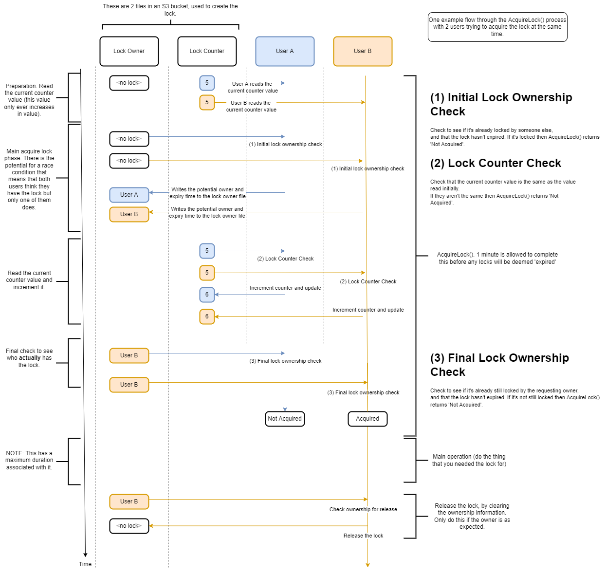

# aws-s3-lock

Creates a lock in S3 without the need for a database. This DOES NOT lock an S3 file as this can't be done at present, but by using S3 files it can create an exclusive lock that can be used to co-ordinate access to other resources, including other S3 files.

The general flow is:

1. Attempt to acquire the lock
2. If successful, perform the main operation you wanted the lock for (e.g. updating some resource in S3 or elsewhere). NOTE: This main operation should take no longer than the configured timeout.
3. Release the lock

It is assumed that won't be too many in flight requests at once else it's possible that no-one will ever acquire a lock. There is no backoff strategy employed by this module.

When multiple requests are in flight, at most one, but potentially zero requests will acquire the lock.

## When should I use this?

It's best to fall back to using a 'proper' lock as found in a database, but if you want something that is self-contained within AWS S3, and so avoids you having to learn and use dynamodb or some other database, then perhaps this library could be useful.

I suggest that this is used as a tactical solution rather than a long-term architecture choice.

## Costs

For the calls to acquire, release and check the status of a lock, there will potentially be several read and write calls to AWS S3, which will cost, small amounts, of money. Monitor your costs - this is your responsibility!

## Example workflow



## Install

``` bash
# Install from github
npm install https://github.com/jfstephe/aws-s3-lock
```

## Use

``` typescript
import { S3Lock, LockRequestResult, LockResultEnum } from 'aws-s3-lock';

// Set the maximum duration the main operation is expected to take.
// The 'main operation' could be anything and is not governed by this module. FYI AWS operations have have a 2 minute timeout by default.
const mainOperationDurationInMinutes = 2;
// NOTE: The S3 bucket and folder needs to exist already.
// AWS credentials are take from the AWS credentials file or environment variables.
const s3Lock: S3Lock = new S3Lock('existing-s3-bucket-name', 'existing-s3-bucket-folder', 'lock-name', mainOperationDurationInMinutes);

const ownerName = 'Potential Owner Name';
let lockRequestResult: LockRequestResult;
try {
  // This will not throw an exception in general unless an error occurred trying to 'rollback' a lock.
  await lockRequestResult = s3Lock.acquireLock(ownerName);
}
catch (err) {
  lockRequestResult = new LockRequestResult(ownerName, LockResultEnum.NotAcquired, err.message, ErrorCodeEnum.DuringLockRelease);
}

if (lockRequestResult.succeeded) {
  try {
    /*
    DO THE 'MAIN OPERATION' here. This is the thing that you wanted to acquire a lock for. E.g. updating other S3 files without worrying about multiple people changing them (assuming they are using this module too).
    */
    // Release the lock if we were successful.
  }
  finally {
    s3Lock.releaseLock(ownerName);
  }
}
```

## Build + Test

``` bash
# To setup:
npm install
# To build:
npm run build
# To test:
# NOTE: You will need to change the load and integration tests to use a bucket owned by you. The S3 folder needs to exist too.
# AWS credentials are take from the AWS credentials file or environment variables.
npm test
```

## Credits

Thanks goes to Andrew-Bx for assisting with this library.
